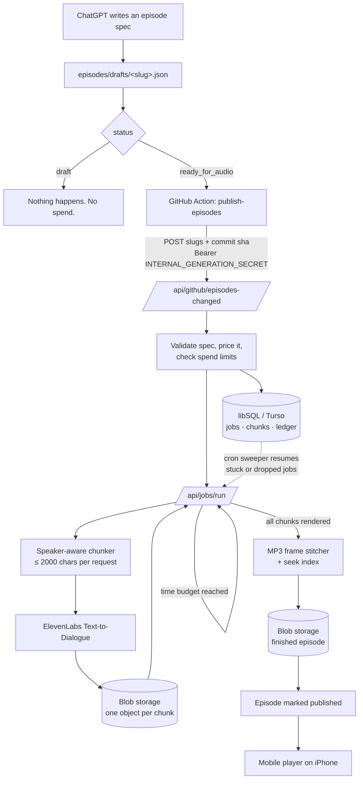

# Build OS Radio

A private, mobile-first podcast system. You write an episode as structured data
in a conversation, commit it to this repository, and the deployment renders it
with ElevenLabs, stitches it, stores it and serves it to your phone.

The pipeline exists so that producing an episode is one edit to one field:

```
"status": "draft"  ->  "status": "ready_for_audio"
```

Everything after that is automatic, bounded in cost, resumable on failure, and
visible in a studio view before you spend a cent.

---

## Contents

- [What it is](#what-it-is)
- [Architecture](#architecture)
- [Source-of-truth model](#source-of-truth-model)
- [The episode specification](#the-episode-specification)
- [Episode lifecycle](#episode-lifecycle)
- [Cost model](#cost-model)
- [Spend protection](#spend-protection)
- [Local development](#local-development)
- [First milestone: prove ElevenLabs works](#first-milestone-prove-elevenlabs-works)
- [Deploying to Vercel](#deploying-to-vercel)
- [ElevenLabs setup](#elevenlabs-setup)
- [Storage setup](#storage-setup)
- [Database setup](#database-setup)
- [GitHub integration](#github-integration)
- [Publishing workflow](#publishing-workflow)
- [Writing episodes with ChatGPT](#writing-episodes-with-chatgpt)
- [Security model](#security-model)
- [Testing](#testing)
- [Troubleshooting](#troubleshooting)
- [Project layout](#project-layout)

---

## What it is

Build OS Radio is four things stacked in a deliberate order:

1. **A portable episode format.** An episode is JSON — a versioned schema with a
   cast, an ordered dialogue array, chapters and sources. Not a transcript.
2. **A renderer.** ElevenLabs Text-to-Dialogue turns the dialogue into audio,
   chunk by chunk, with the correct voice per speaker.
3. **A pipeline.** Chunking, generation, stitching, storage and publication,
   with cost telemetry and idempotency so a repeated trigger is free.
4. **A player.** A private podcast library built for one iPhone.

ElevenLabs is a renderer, not the data model. Nothing above layer 2 knows it
exists, so the episodes outlive any provider decision.

---

## Architecture



The job runner calls itself rather than blocking: a long episode renders across
several serverless invocations, and each chunk is persisted the moment it is
paid for, so a timeout, a crash or a deploy mid-render costs nothing extra.

---

## Source-of-truth model

This split is the most important design decision in the project. Nothing has
two owners.

| Layer | Owns | Why |
| --- | --- | --- |
| **GitHub** | The authored episode specification | Versioned, diffable, reviewable, and writable by ChatGPT |
| **Database** | Processing and runtime state: jobs, chunks, attempts, cost | Needs transactions and uniqueness constraints; changes constantly |
| **Blob storage** | Generated media | Binary artefacts do not belong in git |
| **This app** | Orchestration and UI | Holds the provider credentials; decides what anything costs |
| **ElevenLabs** | Rendering | Replaceable |

A spec push never overwrites runtime state, and a render never writes back to
GitHub. If the database were lost, every episode could be re-derived from the
repository; if GitHub were unreachable, the player keeps serving from the cached
specs.

---

## The episode specification

Full reference: [`docs/EPISODE_SCHEMA.md`](docs/EPISODE_SCHEMA.md).
Validation lives in [`lib/episode/schema.ts`](lib/episode/schema.ts) (Zod).

```json
{
  "schema_version": 1,
  "id": "subway-hidden-strategy",
  "slug": "subway-hidden-strategy",
  "title": "Subway's Hidden Strategy Game",
  "subtitle": "Debt, network shape, timing, and strategic archetypes",
  "project": "party-games",
  "created_at": "2026-09-17T14:00:00Z",
  "status": "draft",
  "format": "host_guest",
  "estimated_runtime_minutes": 20,
  "speakers": {
    "host": { "name": "Build", "voice_id": "" },
    "guest": { "name": "Strategy Analyst", "voice_id": "" }
  },
  "dialogue": [
    { "speaker": "host", "text": "Today we're digging into the strategy underneath Subway..." },
    { "speaker": "guest", "text": "The most interesting one is debt timing...", "delivery": "thoughtfully" }
  ],
  "chapters": [],
  "sources": []
}
```

Notes:

- `slug` must match the filename and be kebab-case.
- `voice_id: ""` means "resolve from configuration" — usually what you want, so
  voices are not baked into content.
- `delivery` is optional; inline cues like `[laughing]` inside `text` also work.
  Both count toward billed characters, and the estimator includes them.
- `generation` and `audio` blocks are optional in an authored file. They exist
  for portability (an exported episode carries its own telemetry); the database
  is authoritative for anything the renderer learned.

Validate everything in the repo, with prices:

```bash
npm run episodes:validate
```

---

## Episode lifecycle

```
draft ──► ready_for_audio ──► queued ──► generating ──► stitching ──► uploading ──► published
                                  │            │             │             │
                                  └────────────┴─────────────┴─────────────┴──► failed
```

- **draft** — the only safe state. Never renders, whatever else happens.
- **ready_for_audio** — you have authorised spending on this exact content.
- **queued … uploading** — owned by the runtime, never by an authored file.
- **published** — audio exists and the episode is in the library.
- **failed** — an explicit state carrying the reason. Chunks already rendered
  are kept, so retrying resumes rather than restarts.

Transitions are deliberate: nothing is inferred from whether a file happens to
exist.

---

## Cost model

Calibrated for a standard 20-minute Build OS Radio episode:

| Characters | Estimated cost | Typical runtime |
| --- | --- | --- |
| 15,000 | $1.50 | ~17 min |
| 17,000 | $1.70 | ~20 min |
| 18,000 | $1.80 | ~21 min |
| 20,000 | $2.00 | ~23 min |

Rates are configuration, not constants (`ELEVENLABS_USD_PER_1K_CHARS`, default
`0.1` per 1,000 characters). Treat them as planning estimates; the ledger
records provider-reported usage whenever ElevenLabs exposes it, so you can
reconcile against the real invoice.

Before generating, the studio shows exactly what you are about to buy:

```
READY TO GENERATE
The Pipeline That Pays For Itself
Estimated runtime      5:06
Words                  724
Characters             4,151
Dialogue chunks        3
Estimated cost         $0.42
```

Afterwards it records characters sent, chunk count, attempts, retries,
provider request ids, per-chunk cost, final duration and timestamps. That data
is kept so the relationship between words, characters, runtime and cost can be
calibrated later — `generate:local` prints the measured characters-per-second
so you can tune `RUNTIME_CHARS_PER_SECOND` from real renders.

---

## Spend protection

Six independent guards, any one of which would prevent a runaway bill:

1. **Draft gate.** Only `ready_for_audio` can spend.
2. **Idempotency per content version.** Every render is keyed on a hash of the
   dialogue, cast, voices and model. A replayed webhook, a double-clicked
   button and a re-run workflow all converge on the same job. Change one line of
   dialogue and the hash changes — correctly, because it is a different episode.
3. **Delivery receipts.** Webhook and Action delivery ids are recorded before
   any work begins, so a redelivery during a run is still a no-op.
4. **Hard ceilings.** `MAX_EPISODE_CHARACTERS`, `MAX_ESTIMATED_COST_USD` and
   `MAX_REQUESTS_PER_JOB` refuse an over-budget job rather than trimming it.
5. **Bounded retries.** `MAX_ATTEMPTS_PER_CHUNK` with exponential backoff, and
   only for errors the provider marked retryable. There is no unbounded loop
   anywhere in the codebase.
6. **Chunk reuse.** Audio already paid for is never re-purchased on resume.

Regeneration is always explicit, always confirmed in the UI, and always
labelled with what it will cost.

---

## Local development

```bash
npm install
cp .env.example .env.local     # fill in ELEVENLABS_* , ADMIN_PASSWORD, SESSION_SECRET
npm run db:init                # creates data/build-os-radio.db
npm run dev                    # http://localhost:3000
```

With no `BLOB_READ_WRITE_TOKEN`, audio is written to `data/media` and served by
the `/media` route (with range requests, so seeking works); with no `DATABASE_URL`, a file database is used. Nothing cloud-side is
required to run the whole pipeline on your machine.

Useful commands:

```bash
npm test                                          # 100+ unit and pipeline tests
npm run typecheck
npm run episodes:validate                         # validate + price every spec
npm run episodes:estimate -- <slug> --chunks      # per-chunk cost breakdown
npm run episodes:publish -- <slug>                # draft -> ready_for_audio
npm run generate:local -- <slug> --dry-run        # chunk plan, no spend
npm run generate:local -- <slug>                  # real render to ./out/<slug>.mp3
```

---

## First milestone: prove ElevenLabs works

Do this before deploying anything. It exercises the real chunker, the real
client and the real stitcher, and writes an MP3 you can listen to — with no
database, no cloud storage and no webhooks in the way.

```bash
# 1. Put your key and two voice ids in .env.local
# 2. See the plan and the price without spending
npm run generate:local -- pipeline-that-pays-for-itself --dry-run

# 3. Render it (~$0.42 for the bundled 5-minute sample)
npm run generate:local -- pipeline-that-pays-for-itself
open out/pipeline-that-pays-for-itself.mp3
```

You should hear two distinct voices, clean transitions between chunks, and a
file whose duration matches the reported one. Only then wire up the rest.

Full acceptance checklist: [`docs/ACCEPTANCE.md`](docs/ACCEPTANCE.md).

---

## Deploying to Vercel

1. **Import the repository** at [vercel.com/new](https://vercel.com/new).
   Framework preset: Next.js. No build settings to change.

2. **Add environment variables** (Settings → Environment Variables), for
   Production and Preview:

   | Variable | Value |
   | --- | --- |
   | `ELEVENLABS_API_KEY` | from ElevenLabs |
   | `ELEVENLABS_HOST_VOICE_ID` | voice id |
   | `ELEVENLABS_GUEST_VOICE_ID` | voice id |
   | `ADMIN_PASSWORD` | your password |
   | `SESSION_SECRET` | `openssl rand -hex 32` |
   | `INTERNAL_GENERATION_SECRET` | `openssl rand -hex 32` |
   | `DATABASE_URL` | `libsql://…` from Turso |
   | `DATABASE_AUTH_TOKEN` | from Turso |
   | `GITHUB_REPO` | `youruser/build_radio` |
   | `APP_BASE_URL` | your final URL, if you use a custom domain |

3. **Create a Blob store** (Storage → Create → Blob) and connect it to the
   project. Vercel injects `BLOB_READ_WRITE_TOKEN` automatically.

4. **Deploy**, then open the URL and sign in with `ADMIN_PASSWORD`.

5. **Enable Cron.** `vercel.json` already declares a 10-minute sweep of
   `/api/cron/tick`, which resumes any job whose continuation call was lost.
   Vercel sets `CRON_SECRET` for you; the endpoint accepts it or the internal
   secret.

6. **Function duration.** `/api/jobs/run` declares `maxDuration = 60`, which is
   valid on every plan. On Pro you can raise it (up to 300) and raise
   `INVOCATION_BUDGET_MS` with it — fewer hand-offs, same result. The default
   45s budget renders roughly 3-6 chunks per invocation.

---

## ElevenLabs setup

1. Create an API key: **Settings → API Keys**. Give it text-to-speech access.
   It belongs only in Vercel's environment variables and your `.env.local`.
2. Choose two voices in the **Voice Library**, add them to your workspace, and
   copy each voice id into `ELEVENLABS_HOST_VOICE_ID` / `ELEVENLABS_GUEST_VOICE_ID`.
3. The default model is `eleven_v3`, which supports Text-to-Dialogue and the
   bracketed delivery cues (`[curious]`, `[laughing]`). Override with
   `ELEVENLABS_MODEL_ID` if you prefer another.
4. Output format defaults to `mp3_44100_128`. Keep an MP3 format: the stitcher
   joins MP3 frames losslessly, which is what removes the FFmpeg dependency.

Additional roles later (Game Designer, Historian, …) need no code change: add
the speaker to the spec's `speakers` map and set
`ELEVENLABS_VOICE_<SPEAKER_KEY>`.

---

## Storage setup

**Vercel Blob (recommended).** Create the store, connect it to the project, and
the app uploads finished episodes plus one object per chunk. Objects are public
with a random suffix — an unguessable URL. If you want strictly private media,
switch `VercelBlobStore` to `access: 'private'` and stream through a route
handler; the `MediaStore` interface already isolates that change.

**Local.** With no token, files land in `data/media` (gitignored) and are served by the `/media` route handler, which requires a session and honours range requests.

**Something else.** Implement `MediaStore` in
[`lib/storage/media-store.ts`](lib/storage/media-store.ts) — four methods — and
return it from `createMediaStore()`.

---

## Database setup

Any libSQL-compatible database works, because both drivers are the same client.

**Turso (recommended for production):**

```bash
turso db create build-os-radio
turso db show build-os-radio --url          # -> DATABASE_URL
turso db tokens create build-os-radio       # -> DATABASE_AUTH_TOKEN
```

**Local:** the default `file:./data/build-os-radio.db` needs no setup.

The schema is applied on first use — every statement is `CREATE … IF NOT
EXISTS`, so there is no migration step. `npm run db:init` applies it and prints
row counts. Tables: `episodes`, `jobs`, `chunks`, `generation_attempts`,
`job_events`, `delivery_receipts`.

---

## GitHub integration

Two options. **Option A (the default, and the one that ships wired up)** keeps
every secret out of GitHub except one shared token.

### Option A — GitHub Action (recommended)

`.github/workflows/publish-episodes.yml` watches `episodes/**/*.json` on `main`,
works out which slugs changed, and posts them to
`/api/github/episodes-changed` with the internal secret. It sends the commit
sha as the delivery id, so re-running the workflow cannot start a second paid
render.

Add two repository secrets (Settings → Secrets and variables → Actions):

| Secret | Value |
| --- | --- |
| `BUILD_OS_RADIO_URL` | `https://your-app.vercel.app` |
| `INTERNAL_GENERATION_SECRET` | same value as in Vercel |

### Option B — webhook

If you would rather GitHub talk to the app directly: repository → Settings →
Webhooks → Add webhook.

- Payload URL: `https://your-app.vercel.app/api/webhooks/github`
- Content type: `application/json`
- Secret: the value of `GITHUB_WEBHOOK_SECRET`
- Events: **Just the push event**

Signatures are verified against the raw body with HMAC-SHA256, and the
`X-GitHub-Delivery` id is recorded before any work starts.

Either way, GitHub never holds the ElevenLabs key. It only ever names episodes;
this deployment decides what that costs.

---

## Publishing workflow

```bash
# 1. A spec arrives in episodes/drafts/<slug>.json (written by ChatGPT or by hand)
npm run episodes:validate

# 2. Authorise the spend
npm run episodes:publish -- <slug>

# 3. Commit — this is the audit trail of who authorised the render
git add episodes && git commit -m "Publish <slug>" && git push
```

The Action fires, the app validates and prices the spec, queues one job, renders
the chunks, stitches, uploads, and the episode appears in the library. Watch it
at `/admin/episodes/<slug>`.

You can also generate from the studio UI without touching git — the button
shows the cost before it spends anything.

---

## Writing episodes with ChatGPT

See [`docs/CHATGPT.md`](docs/CHATGPT.md) for a copy-pasteable system prompt and
the exact contract ChatGPT must follow. The short version:

- ChatGPT researches and writes the episode. This application never writes
  scripts; it receives, renders, stores and plays them.
- It emits a single JSON object matching `schema_version: 1`, always with
  `"status": "draft"`.
- It commits to `episodes/drafts/<slug>.json` (via the GitHub connector, an
  Action, or you pasting the file).
- You say "publish it", which flips the status — the one deliberate step
  between a conversation and a bill.

---

## Security model

- **Secrets stay server-side.** `ELEVENLABS_API_KEY`, blob and database
  credentials, and both shared secrets are read only in server modules. No
  `NEXT_PUBLIC_` variable exists in this project.
- **Pages require a session.** `proxy.ts` (Next.js 16's middleware convention)
  gates every page on a signed, HTTP-only cookie (HMAC-SHA256, 30-day expiry).
- **API routes authenticate themselves**, because they accept a second identity:
  `/api/generate` and `/api/admin/audio` take a session *or* the internal
  secret; `/api/jobs/run` takes only the internal secret; the webhook takes only
  a valid GitHub signature.
- **Constant-time comparisons** for every secret check.
- **Logs are redacted.** Live secret values are stripped from log lines and
  persisted events, including when they appear inside a provider error message.
- **No unauthenticated path can spend money.** That is the invariant the tests
  in `tests/auth.test.ts` and `tests/pipeline.test.ts` exist to protect.

---

## Testing

```bash
npm test
```

102 tests covering the things that would actually hurt:

| Area | What is proved |
| --- | --- |
| Episode parsing | valid specs, unsupported schema version, unknown speaker, invalid state, bad slug, malformed JSON, unknown fields |
| Chunking | speaker/paragraph/sentence boundaries, abbreviation handling, no chunk over the limit, exact dialogue order, text preserved across splits, ~9 chunks for a 17k-character episode |
| Cost | known character counts match the documented budget, configurable rates, delivery cues billed, ceilings enforced |
| State transitions | a draft cannot generate, a ready episode queues, a duplicate trigger does not duplicate billing, failures retry within a cap, a spec edited mid-flight cancels instead of splicing |
| Audio | real LAME-encoded fixtures, tag stripping, duration accounting, ordering, refusal to stitch an incomplete or mismatched set |
| Webhooks | bad signature rejected, wrong-secret rejected, wrong-body rejected, duplicate delivery ignored |

The pipeline tests run the real store against an in-memory libSQL database and
the real ElevenLabs client against a scripted transport — no mocks of our own
code, so the guarantees are the production ones.

---

## Troubleshooting

**"No voice id for speaker(s): guest"** — set `ELEVENLABS_GUEST_VOICE_ID`, or
put a `voice_id` on that speaker in the spec. Voice ids are part of the content
version, so changing one is correctly treated as a new render.

**The episode stays "queued"** — the continuation call was lost. The cron sweep
picks it up within 10 minutes; to force it now, open `/admin` (which resyncs) or
call `/api/jobs/run` with the internal secret. Check `INTERNAL_GENERATION_SECRET`
and `APP_BASE_URL` are set — without them the runner cannot call itself.

**"Episode changed while queued"** — the spec was edited after the job was
created. This is the guard working: fix or accept the spec, then generate again.

**"Cannot stitch: N chunk(s) have no audio"** — a chunk failed. The studio's
chunk grid shows which; use *Regenerate failed chunks* to re-render only those.

**Job fails immediately with a 401** — the ElevenLabs key is wrong or lacks
permission. The failure is recorded in the ledger with `error_kind: auth`, and
nothing is retried (retrying an auth error only wastes time).

**Audio plays but scrubbing jumps to the wrong place** — this is exactly what
the synthesized seek index prevents; if you see it, the file was probably not
produced by this stitcher. Regenerate the episode.

**Estimates drift from reality** — run `npm run generate:local` and read the
reported characters-per-second, then set `RUNTIME_CHARS_PER_SECOND`. Your voices
and pacing are not the defaults.

**Deploy fails on the database** — `@libsql/client` is declared in
`serverExternalPackages`; keep it there. A remote `libsql://` URL uses the
HTTP driver, a `file:` URL uses the native one.

---

## Project layout

```
app/
  page.tsx                     library (mobile-first)
  episodes/[slug]/             episode page: player, chapters, transcript, sources
  admin/                       studio: estimates, chunk state, controls, logs
  login/                       single-password sign-in
  api/
    generate/                  queue a render (session or internal secret)
    jobs/run/                  the worker; continues itself until done
    github/episodes-changed/   GitHub Action entry point (option A)
    webhooks/github/           signed webhook entry point (option B)
    cron/tick/                 sweeper: resync specs, resume stuck jobs
    admin/audio/               delete generated audio
    auth/                      login / logout
    media/[...key]/            local audio delivery (dev), range-request capable
components/
  audio-player.tsx             play, pause, seek, ±15s, speed, resume position
  generation-controls.tsx      spend-visible actions
lib/
  episode/schema.ts            the episode specification (Zod, versioned)
  episode/source.ts            GitHub + filesystem spec loading
  episode/service.ts           spec + runtime state, render planning
  episode/version.ts           content addressing (idempotency)
  chunking.ts                  speaker-aware chunker
  cost.ts                      estimates, limits, formatting
  elevenlabs.ts                renderer client, error taxonomy, bounded retries
  audio/mp3.ts                 MP3 frame parser, concatenation, seek index
  audio/stitcher.ts            stitching boundary (swappable for a worker)
  storage/media-store.ts       Blob / local / in-memory media
  db/                          libSQL client, schema, typed store
  jobs/                        queueing, running, dispatch, triggers
  auth.ts                      sessions, internal secret, webhook signatures
  log.ts                       structured logging with secret redaction
proxy.ts                       session gate for every page
episodes/
  drafts/                      authored specs (safe: never render)
  published/                   specs you have authorised
scripts/                       validate, estimate, publish, local render, db init
tests/                         unit + pipeline tests
docs/                          schema, ChatGPT contract, acceptance checklist
```

---

## What is deliberately not built

No public accounts, no social features, no subscriptions, no payments, no
multi-tenancy, no analytics beyond cost telemetry, no video, no script
generation inside the app. ChatGPT writes the podcast; Build OS Radio receives,
renders, stores and plays it.

Architected for but not built: private RSS, recurring personalities, automatic
chapters from audio, artwork, waveforms, transcript highlighting, search,
cross-device playback sync.
